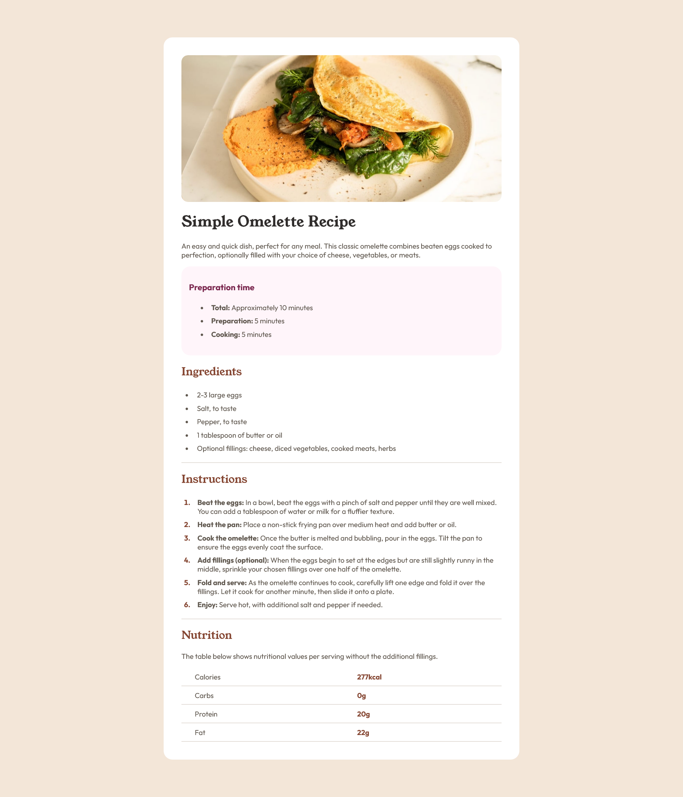

# Frontend Mentor - Recipe page solution

This is a solution to the [Recipe page challenge on Frontend Mentor](https://www.frontendmentor.io/challenges/recipe-page-KiTsR8QQKm). Frontend Mentor challenges help you improve your coding skills by building realistic projects.

## Table of contents

- [Overview](#overview)
  - [Screenshot](#screenshot)
  - [Links](#links)
- [My process](#my-process)
  - [Built with](#built-with)
  - [What I learned](#what-i-learned)
  - [Continued development](#continued-development)
  - [Useful resources](#useful-resources)
- [Author](#author)
- [Acknowledgments](#acknowledgments)

## Overview

### Screenshot



### Links

- Solution URL: (https://github.com/Aarzoo04/fem-Recipe_Page)
- Live Site URL: (https://aarzoo04.github.io/fem-Recipe_Page/)

## My process

### Built with

- Semantic HTML5 markup
- CSS custom properties

### What I learned

During this challenge, I focused on structuring HTML semantically and improving my CSS skills. 

Here’s a small snippet of my CSS:

```css
main {
    max-width: 720px;
    margin: 12vh auto;
    background-color: hsl(0, 0%, 100%);
    padding: 40px;
    border-radius: 20px;
    font-family: "Outfit", serif;
}
```

### Continued development

I want to continue improving my CSS layout skills, particularly with CSS Grid and Flexbox. Additionally, I plan to explore adding animations for a better user experience.

### Useful resources

[MDN Web Docs - HTML Semantic Elements](https://developer.mozilla.org/en-US/docs/Glossary/Semantics) - Provided clarity on structuring HTML effectively.

[Google Fonts](https://fonts.google.com/) - Helped me choose the best font pairing for the project.

## Author

Frontend Mentor - ([Aarzoo Saini](https://www.frontendmentor.io/profile/Aarzoo04))

GitHub - [Aarzoo04](https://github.com/Aarzoo04)

LinkedIn - (https://www.linkedin.com/in/aarzoo-saini/)

## Acknowledgments

A big thanks to the Frontend Mentor community for their helpful discussions and resources!
